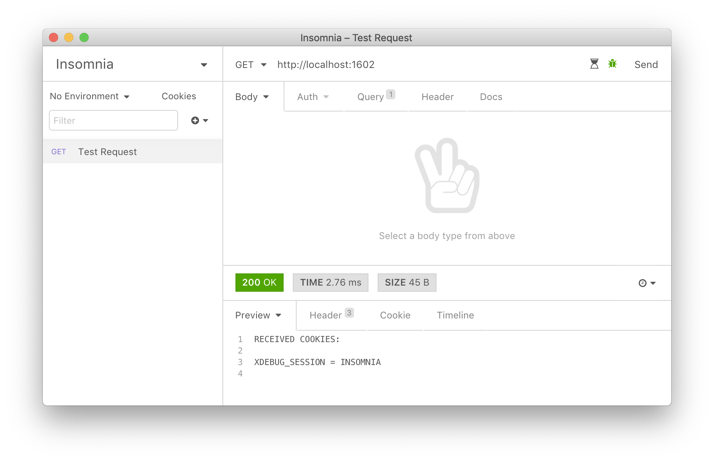

## Insomnia Xdebug Switches

This [Insomnia](https://insomnia.rest) plugin makes it possible to easily enable or
disable [Xdebug](https://xdebug.org) functionality when making API calls. Currently you can
switch between [running the debugger](https://xdebug.org/docs/remote) and running 
[the profiler](https://xdebug.org/docs/profiler).

### Setting the IDE Key
By default the Xdebug IDE key is set to `INSOMNIA`. In most cases there's no need to change this,
but if you'd like to use your own IDE key, just add the key `ide-key` with as value your 
IDE key to your environment. For example: `{ "ide-key": "PHPSTORM" }`.

> This plugin is inspired by the [insomnia-plugin-xdebug](https://gitlab.com/stoempdev/insomnia-plugin-xdebug) plugin.
