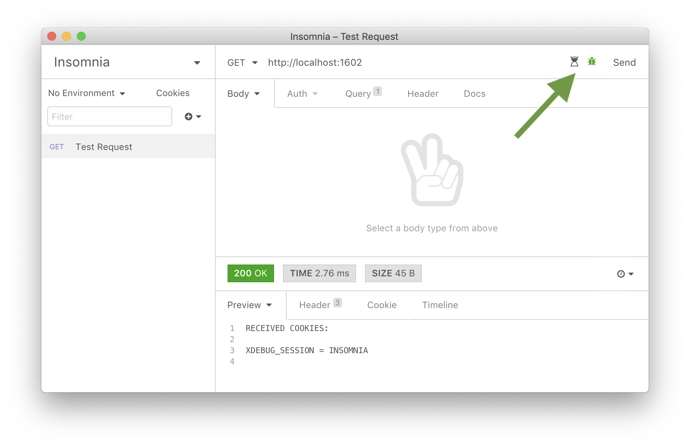

## Insomnia Xdebug Switches

This [Insomnia](https://insomnia.rest) plugin makes it possible to easily enable or
disable [Xdebug](https://xdebug.org) functionality when making API calls. Currently you can
switch between [running the debugger](https://xdebug.org/docs/remote) and running 
[the profiler](https://xdebug.org/docs/profiler).

This plugin is inspired by the [insomnia-plugin-xdebug](https://gitlab.com/stoempdev/insomnia-plugin-xdebug) plugin.
